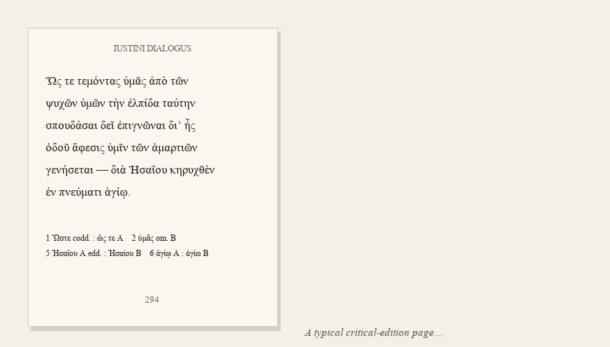

# regreek

**Re-Greek your mojibake: recover polytonic Greek from documents typeset in pre-Unicode Greek fonts — and separate the page layers of critical editions.**



Thousands of scholarly PDFs, Word documents, and web pages produced between
roughly 1985 and 2005 encode Ancient Greek with legacy fonts — Graeca,
SPIonic, SGreek, WinGreek, GreekKeys, Odyssea, and dozens more — whose
characters are stored as **Latin ASCII keystrokes**. Copy text out of such a
document and you get this:

```
dia; JHsai?ou khrucqe;n ejn pneuvmati aJgivw/
```

when the page actually reads:

```
διὰ Ἡσαΐου κηρυχθὲν ἐν πνεύματι ἁγίῳ
```

Every PDF text extractor — `pdftotext`, PyMuPDF, pdfminer — faithfully
reproduces the mojibake, because the fonts' own `ToUnicode` maps point at
Latin. The affected documents include critical editions of exactly the texts
scholars most need machine-readable.

`regreek` turns the keystroke stream back into NFC-normalised
polytonic Unicode Greek, **deterministically**, with a per-character
provenance record and a hard guarantee: **it never invents text**.

```console
$ regreek edition.pdf --page 300
--- page 300
Ὥς τε τεμόντας ὑμᾶς ἀπὸ τῶν ψυχῶν ὑμῶν τὴν ἐλπίδα ταύτην …

$ regreek --text 'i3na mh\ pare/lqh| u9ma~j o9 peirasmo/j'
ἵνα μὴ παρέλθῃ ὑμᾶς ὁ πειρασμός
[encoding: spionic-ascii, auto-detected]
```

```python
from regreek.text import decode_text

r = decode_text("ou0k e0n u9posta/sei ou0si/aj geno/menoj")   # auto-detects SPIonic
r.text          # 'οὐκ ἐν ὑποστάσει οὐσίας γενόμενος'
r.table_id      # 'spionic-ascii'
r.fully_mapped  # True — every input character accounted for
```

## Why trust the output? (the zero-fabrication contract)

This tool is built for scholarly use, where a plausible-but-wrong Greek word
is worse than an honest gap. Three structural guarantees:

1. **No generation.** Decoding is a table lookup plus deterministic
   mark-attachment rules. There is no language model, no OCR, no inference —
   an input character either has an evidenced mapping or it does not.
2. **Unknown input is preserved and flagged, never guessed.** Any character
   without an evidenced mapping passes through verbatim, is listed in
   `unmapped`, and drops the token's confidence to 0. It cannot silently
   vanish — the tokenizer is table-aware precisely so that no code character
   can be mistaken for punctuation and deleted.
3. **Fidelity over correction.** If the source page contains a typo
   (a misplaced accent keyed by the original typist), the output reproduces
   the typo. Correcting it would mean inventing text that is not on the page.

Every decoded token carries `records`: output segment, source keystrokes,
mapped/unmapped status, confidence.

## Where the tables come from, and how they were validated

Tables are **derived empirically, not copied**. The method (fully described
in [`FINDINGS.md`](FINDINGS.md)):

1. Extract the legacy keystroke stream from real, born-digital PDFs of works
   whose Greek text also exists in a reference corpus (TLG-E).
2. Align the two streams (unique-n-gram skeletons + longest increasing
   subsequence) — for Graeca this produced 50,026 exactly-aligned word pairs.
3. Learn each keystroke's value from co-occurrence evidence across the
   alignment; record the evidence counts in the table file itself.
4. **Validate on a different work in the same font** — never on the text the
   table was derived from — by measuring how many decoded tokens are attested
   in the reference corpus.

| Encoding | id | Derivation | Validation |
|---|---|---|---|
| Graeca (Linguist's Software) | `graeca` | corpus alignment, 50k pairs | **99.4 %** attestation on 15,152 held-out tokens |
| GraecaII | `graeca2` | corpus alignment | 100 % / 99.3 % accent-sensitive |
| Odyssea | `odyssea` | corpus alignment | 100 % / 98.8 % accent-sensitive |
| Bwgrkl (BibleWorks) | `bwgrkl` | corpus alignment | 98.1 %, held-out document |
| GrecMonotype (+Acc) | `grecmonotype` | corpus alignment + font layout | 99.5 % (same-document) |
| SPIonic, ASCII keys | `spionic-ascii` | public-domain chart (Adair 1998) | 98.2 % on external web samples |
| SPIonic, stripped CID subset | `spionic-cid` | corpus alignment | 98.1 % (same-document) |
| TimesGreek | `timesgreek` | corpus alignment | **provisional** — no held-out text exists yet |
| SymbolGreekII | `symbolgreek2` | corpus alignment | **weak** — only 23 validation tokens |

Honesty notes are part of the data: each table file records its derivation
source, evidence, measured attestation, and known gaps. Tables that could not
be validated properly say so, in-file and above.

## What it handles

- **Diacritic grammar** — breathings, accents, iota subscript, diaeresis,
  their combinations, and their per-font positioning rules (marks follow the
  vowel; pre-positioned marks queue for word-initial capitals).
- **Final sigma** — positional variants (`"` in Graeca, `j` in SPIonic,
  context-dependent rules in Bwgrkl where `,`/`.` are accent *or*
  punctuation).
- **Line-break hazards** — hyphenated splits and diacritics that migrate to
  the next line (a real case: `aJgivw` + `/` on the next line silently turns
  dative ἁγίῳ into ἁγίω — a genuine case change; repaired and
  regression-tested).
- **PDF subset fonts** — `GFDJFH+Graeca` → `Graeca`; the stripped subsets
  embed no usable `cmap`/`post` tables, which is precisely why glyph-name
  recovery is impossible and keystroke decoding is the right approach.
- **Raw text, not just PDFs** — legacy Greek pasted from old Word documents,
  databases, or 1990s web pages, with deterministic encoding auto-detection.

## Layer separation (critical editions)

A critical-edition page co-registers several layers: the constituted text,
the apparatus criticus at the foot, running heads, page numbers, headings,
a facing-page translation, inline witness references. Fed flat to a search
engine or a language model, they produce the worst scholarly failure mode:
**an apparatus variant quoted as the constituted text**.

`regreek` separates the layers deterministically — font-size registers,
vertical gaps, script signatures; geometry and typography only, no ML, no
content guessing — and never reorders or merges lines:

```console
regreek edition.pdf --layer greek_text   # the constituted text, alone
regreek edition.pdf --layer apparatus    # the apparatus, alone
regreek edition.pdf --layers             # all layers as JSON + evidence
regreek edition.pdf --md                 # structured Markdown per layer
```

Layers: `greek_text`, `translation`, `apparatus`, `notes`, `heading`,
`running_head`, `page_number`. Every band carries its evidence (the measured
size register and gap that justified the label) and a confidence; inline
witness references (`[fol. 94 v° : A]`) are extracted alongside, not removed.

Validation on 55 pages of a bilingual critical edition (two volumes):
running heads and page numbers 55/55; **zero apparatus sigla leaked into the
Greek text layer**; overall sigla routing 97.8 % (the residue sits on
translation-side note-overflow and front-matter pages, both documented
limitations in `FINDINGS.md`).

## CLI

```console
regreek FILE.pdf              # decode all pages
regreek FILE.pdf --page 12    # one page (0-based)
regreek FILE.pdf --json       # JSON with provenance records
regreek FILE.pdf --list-fonts # which legacy fonts are present
regreek --text 'lo/goj'       # decode a string (auto-detect)
regreek --stdin --encoding graeca < dump.txt
regreek --list-encodings
regreek FILE.pdf --layers     # layer separation (see above)
```

Exit status is non-zero when no known legacy content is found; unmapped
codes are reported on stderr.

```python
from regreek import extract_runs, decode_page

for page in extract_runs("edition.pdf", pages=[300]):
  decoded = decode_page(page)
  print(decoded.text)
  for tok in decoded.tokens:
    if not tok.word.fully_mapped:
      print("unmapped codes:", tok.token, tok.word.unmapped)
```

## Scope — what this tool is *not*

- **Not OCR.** It decodes born-digital text layers. Scanned pages need an
  OCR engine first ([Kraken](https://kraken.re) with the Ciaconna model is
  the state of the art for polytonic Greek); note that OCR output is
  *generated*, so it can never carry this tool's fidelity guarantee.
- **Not Beta Code conversion.** For plain Beta Code (`*)ODUSSEU/S`), use
  [`beta-code`](https://github.com/perseids-tools/beta-code-py). SPIonic is
  Beta-Code-*like* but a distinct font encoding, which is why it lives here.
- **Not full layout semantics.** Layer separation (above) isolates the
  apparatus band; *parsing* the apparatus into lemma/readings/witnesses
  (TEI `<app>/<lem>/<rdg>`) is a further, harder problem and deliberately
  out of scope for now.

## Contributing a font

The long tail of legacy fonts (SGreek, WinGreek, Ismini, Vilnius, GreekKeys,
SuperGreek…) needs *data*: a born-digital PDF or text sample in the font,
ideally of a work that exists in a public reference corpus. If you have one,
please [open an issue](../../issues) — the derivation pipeline is
reproducible and documented in `FINDINGS.md`, and a few hundred aligned words
are usually enough to derive and honestly validate a table. Tables copied
from GPL-licensed converters are **not** accepted (this project is MIT; all
tables must be evidence-derived or from permissive/public-domain
documentation).

## Install

```console
pip install regreek
```

Python ≥ 3.10. Single runtime dependency: `pdfminer.six` (MIT).

## Citation

If this tool contributes to published research, please cite it (see
[`CITATION.cff`](CITATION.cff)).

## License

[MIT](LICENSE). The font encoding tables are factual mappings derived from
document evidence or public-domain documentation; each table file carries its
own provenance.
